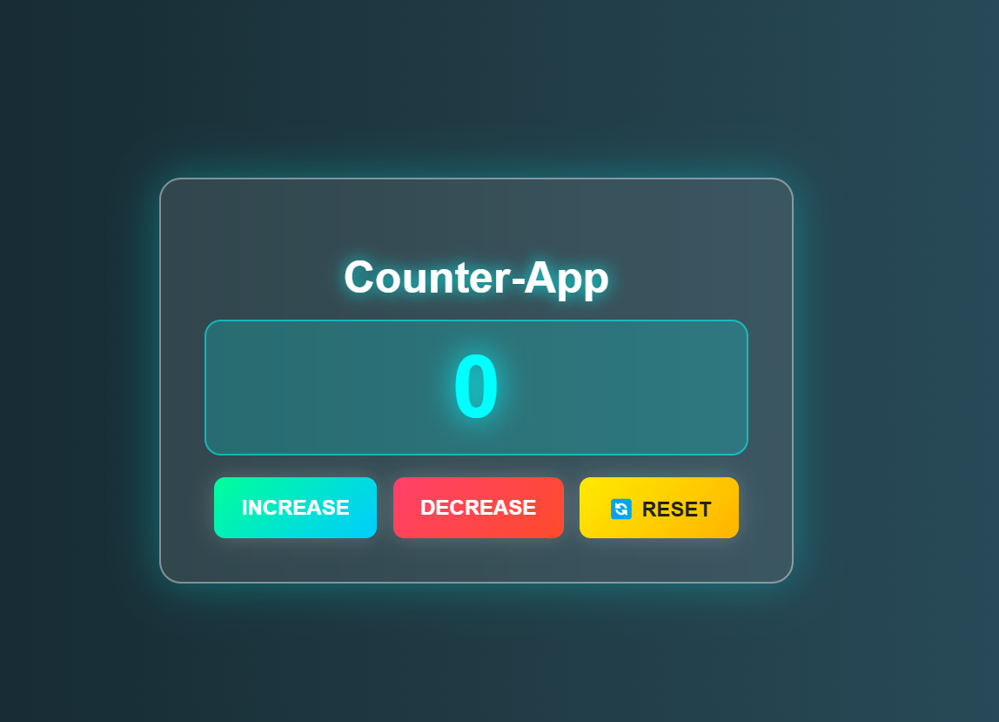

# 🚀 Counter App

A **premium and fully responsive** Counter App built using **DFINITY's Internet Computer**, **Candid UI**, and **Lit-HTML**. This application is designed with a futuristic **glassmorphism UI** and allows users to **increment, decrement, and reset** the counter seamlessly.

---

## 🌟 Features

- ✅ **Modern Glassmorphism UI**
- ✅ **Increment, Decrement, and Reset Functions**
- ✅ **Candid UI Integration** for backend communication
- ✅ **Lightning-fast performance** using Lit-HTML
- ✅ **Fully Responsive** (Works on Mobile, Tablet & Desktop)
- ✅ **Dark Mode Inspired Design** with neon effects

---

## 🛠️ Technologies Used

### **Frontend:**
- 🖥 **Lit-HTML** for lightweight rendering
- 🎨 **CSS3 (Glassmorphism + Gradient Effects)**
- 📜 **JavaScript (ES6+)**

### **Backend:**
- ⚙️ **Rust (DFINITY SDK)**
- 🔄 **Candid UI** for interacting with the backend
- 📡 **ICP Canisters** for smart contract execution

---

## 📦 Installation & Setup

### **1️⃣ Prerequisites**
Make sure you have the following installed:
- **DFX SDK** → [Install Guide](https://internetcomputer.org/docs/current/developer-docs/setup/install)
- **Node.js & NPM** (for frontend dependencies)

### **3️⃣ Install Dependencies**
```sh
npm install
```

### **4️⃣ Start the Internet Computer Local Replica**
```sh
dfx start --background
```

### **5️⃣ Deploy Canisters**
```sh
dfx deploy
```

### **6️⃣ Run Frontend**
```sh
npm start
```
Then, open [http://localhost:8080](http://localhost:8080) in your browser.

---

## 🎨 UI Preview



---

## 📜 API & Candid Interface

**Backend Interface (`counter-app-backend.did`)**
```candid
service : {
  increment: () -> ();
  decrement: () -> ();
  reset: () -> ();
  getCount: () -> (nat);
}
```

### **Interacting with Candid UI**
You can interact with the canister using Candid UI by running:
```sh
dfx canister call counter-app-backend increment
```

---

## 🤝 Contributing
Feel free to fork this repository, submit issues, or create pull requests to improve this project!

---

## 🛡️ License
This project is licensed under the **MIT License**.

---

## 📞 Contact
For any questions or feedback, reach out to:
- 📧 Email: prashantshakya43602003@gmail.com
- 🌐 GitHub: [prashantsagarshkaya](https://github.com/prashant-sagar-shakya)